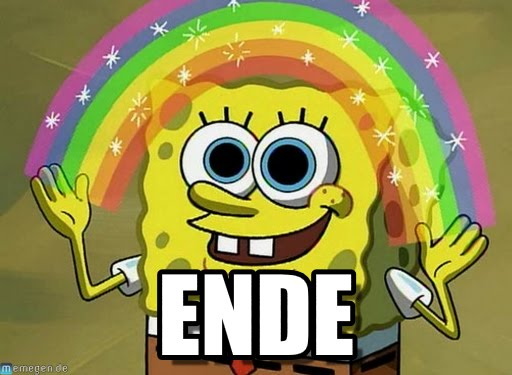

```{r echo = F, cache = F}
database <- read.delim("../stressPositionGerman/database.txt")
database$stressPosition<-as.factor(database$stressPosition)
```

# Stress Position in German words
<div>A Shiny app</div>
<div><small>by Sascha C.</small></div>

--- 

## What is word stress?

The **stressed syllable** within a word is the most prominent syllable  . This prominence can be expressed via:

* Loudness
* Length
* Pitch

For example, in English '<span class="example"><span class="stress">Ba</span>by</span>', the syllable <span class="example">-ba</span> is the most prominent syllable.

---

## German word stress

In German (and English), stress position varies between words. Examples: <div class="example"><span class="stress">Bei</span>spiel ('example'), Zer<span class ="stress">brech</span>lichkeit ('frailty'), unter<span class ="stress">hal</span>ten ('to converse'), kontrol<span class="stress">lie</span>ren ('to control')</div>

<br>There are **regularities**, e.g., most (all?) unprefixed words that are not loan words are stressed on the first syllable.

<br>However, the distribution of German word stress is not clear. For example, how often does stress occur on the second syllable of a word?

--- 

## App functionality

Research question: How is stress position in German distributed accross words?

Functions:
<ul>
  <li>Plot word <span style="border-bottom: dotted 1px blue" title="where position n signifies stress on the nth syllable"><strong>stress position</strong></span> as a function of <strong>word type</strong> and <strong>syllable number</strong>
  <ul>
    <li>Word type: Adjective, Noun, Verb</li>
    <li>Syllable number: from 2 to 5 syllables</li>
  </ul>
  <li>Control for <strong>word frequency</strong></li>
  <ul>
    <li>For example, restrict analysis to words with a minimal frequency of 1000.</li>
  </ul>
</ul>

---

## App data base

The <a href="#" title="Excerpt of the database">data base</a> of the app </a> consists of 42,693 words selected from the <a href="https://catalog.ldc.upenn.edu/ldc96l14" target="_blank">CELEX lexical database for German</a>. 

Selection criteria: word type = Adjective/Noun/Verb, 2 - 5 syllables long
```{r}
table(database$wordType, database$syllableNumber)
```

Further information in the data base, extracted from CELEX: **word frequency**, **syllable number**, **<span style="border-bottom: dotted 1px blue" title="where position n signifies stress the nth syllable">stress position</span>**, **word type**

---

<center></center>
<h1><span class=example><span class=stress>En</span>de!</h1>


